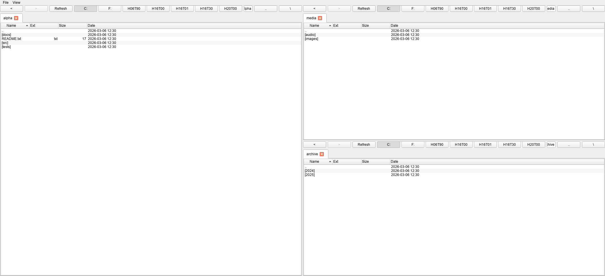
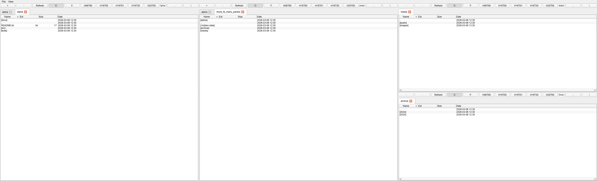
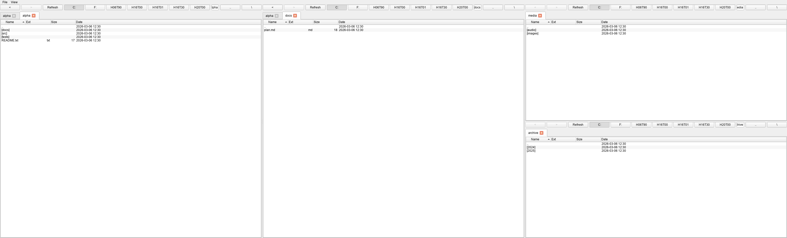

# many-panelz-explorer

A multi-panel, Windows-focused file explorer built with PySide6. Supports splittable panels, tabbed navigation, persistent layouts, and multi-window sessions.

## Table of Contents

- [Features](#features)
- [UI Walkthrough](#ui-walkthrough)
- [Requirements](#requirements)
- [Installation](#installation)
- [Usage](#usage)
- [Configuration](#configuration)
- [Keyboard Shortcuts](#keyboard-shortcuts)
- [Menus](#menus)
- [Project Structure](#project-structure)
- [Architecture](#architecture)
- [Development](#development)
- [Troubleshooting](#troubleshooting)
- [Legal Disclaimer](#legal-disclaimer)

## Features

- **Multi-panel layout** - split views with horizontal and vertical pane arrangements using a binary tree-based layout system
- **Tabbed navigation** - multiple tabs per panel for managing different folder contexts
- **Panel management** - create, split (vertical/horizontal), clone, and close panels freely
- **File operations** - copy, cut, paste, rename, delete (to Recycle Bin via send2trash)
- **Folder operations** - create new folders, ZIP create/extract
- **Navigation** - back/forward/up buttons, address bar, root/drive buttons, history menu
- **Saved views** - save and restore named workspace layouts across sessions
- **Multi-window sessions** - persistent window state (geometry, panels, tabs) restored on restart
- **Selection memory** - remembers selected files when navigating back to a previously visited folder
- **Always on top** - per-window toggle
- **Hidden files toggle** - show/hide hidden and system files
- **Terminal integration** - open PowerShell (Windows) or x-terminal-emulator (Linux) at the current path
- **Properties dialog** - path, type, size, and file count for selected items

## UI Walkthrough

1. Configure panels and roots for your workspace.

   

   Multi-panel overview for opening and organizing primary working folders.

2. Navigate split views to compare locations quickly.

   

   Tabbed and split workflow state for moving between folder contexts.

3. Inspect focused details before file operations.

   

   Focused details/navigation state for reviewing selected paths.

## Requirements

- **Windows** (10 or later; also works on Linux/macOS via PySide6)
- **Python 3.13+**

Runtime dependencies: `PySide6 >=6.10.2`, `send2trash >=2.1.0`.

## Installation

### First-time Setup

```bat
python scripts\windows\setup_env.py
```

Creates the `.venv` by running `uv sync --locked` (falls back to `uv sync` if no lockfile).

Manual alternative for development:

```bat
uv sync --group dev
```

## Usage

### Recommended (console-less)

```bat
pyw scripts\windows\run_app_gui.pyw
```

Launches the GUI without a console window. Auto-bootstraps the `.venv` via `setup_env.py` if not yet created.

### With console

```bat
python scripts\windows\run_app.py
```

Runs via `hatch run python -m many_panelz_explorer`. Requires `hatch` in PATH.

### Direct

```bat
python -m many_panelz_explorer
```

No command-line arguments. The app restores the previous session (windows, panels, tabs) on startup.

## Configuration

Runtime settings are stored via QSettings:

- Backend: `QSettings(IniFormat)` at `%APPDATA%\ManyPanelz\settings.ini`
- No config files or environment variables required.

### Persisted Settings

| Key | Description |
|---|---|
| `defaults/new_context_mode` | How new panels/tabs determine their starting path (`"home"`, `"cwd"`, or `"clone_active_path"`) |
| `view/show_hidden_default` | Toggle hidden files visibility (default: true) |
| `view/show_root_dropdown` | Show/hide root selector dropdown (default: false) |
| `session/windows` | List of window IDs for session restoration |
| `views/saved` | Named saved view layouts (JSON) |
| `window/{id}/panel_tree` | Panel layout tree (JSON) |
| `window/{id}/tabs` | Tab state for each panel (JSON) |
| `window/{id}/on_top` | Window always-on-top state |
| `window/{id}/geometry` | Window size/position |

## Keyboard Shortcuts

| Key | Action |
|---|---|
| **Window/Panel Management** | |
| Ctrl+T | New tab in active panel |
| Ctrl+P | New vertical panel (horizontal split) |
| Ctrl+H | New horizontal panel (vertical split) |
| Ctrl+N | New window |
| Ctrl+W | Close tab |
| Ctrl+Shift+W | Close panel |
| Alt+W | Close window |
| Alt+X | Exit application |
| **Navigation** | |
| Alt+Left | Back |
| Alt+Right | Forward |
| Alt+Up | Up to parent directory |
| Backspace | Up to parent directory |
| Left | Up to parent (tree view) |
| Right | Open selected item (tree view) |

## Menus

**File**:
- New Tab (Ctrl+T)
- New Vertical Panel (Ctrl+P)
- New Horizontal Panel (Ctrl+H)
- Clone Current Panel (Vertical)
- Clone Current Panel (Horizontal)
- New Window (Ctrl+N)
- Clone Current Window
- Save View / Restore View / Replace View
- Close Tab (Ctrl+W) / Close Panel (Ctrl+Shift+W) / Close Window (Alt+W)
- Exit (Alt+X)

**View**:
- On top (checkable toggle)
- Show hidden files (checkable toggle)

**Context Menu** (right-click in file tree):
- Open
- Rename
- New folder
- Copy / Cut / Paste / Move...
- Delete
- Properties
- Create ZIP... / Extract ZIP...
- Open terminal here

## Project Structure

```text
many-panelz-explorer/
|-- pyproject.toml
|-- uv.lock
|-- src/
|   `-- many_panelz_explorer/
|       |-- __init__.py              # Package version metadata
|       |-- __main__.py              # Entry point
|       |-- app_controller.py        # Multi-window management, session save/restore
|       |-- window.py                # Main QMainWindow with menu bar and panel layout
|       |-- panel_widget.py          # Panel container: tabs, toolbar, focus handling
|       |-- explorer_tab.py          # Individual file browser tab with QTreeView
|       |-- panel_tree.py            # Pure data model for binary split tree layout
|       |-- file_ops.py              # File operations: copy/move/delete, ZIP, rename
|       |-- settings.py              # QSettings wrapper with JSON support
|       |-- mounts.py                # Platform-specific root/drive discovery
|       `-- dialogs/
|           `-- properties_dialog.py # File/folder properties dialog
|-- scripts/
|   |-- policy/
|   |   `-- check_standard.py
|   `-- windows/
|       |-- setup_env.py              # Create/verify .venv via uv sync
|       |-- run_app.py               # Launch app via hatch run
|       |-- run_app_gui.pyw          # Launch GUI without console window
|       `-- run_tests.py             # Run tests via hatch run test
|-- docs/
|   `-- images/
|       |-- ui-01-overview.png
|       |-- ui-02-workflow.png
|       `-- ui-03-details.png
|-- tests/
|   `-- ...                          # pytest suite with pytest-qt
`-- .pre-commit-config.yaml
```

## Architecture

- `src/` layout with `many_panelz_explorer` package.
- `AppController` manages multiple windows, session save/restore, and window activation loop guards.
- **Binary tree layout model** (`panel_tree.py`): pure data model (`LeafNode`/`SplitNode`) for splittable panel arrangements, serializable to JSON with no Qt dependencies.
- `Window` (`window.py`) is the main QMainWindow with menu bar and panel layout management.
- `PanelWidget` contains tabs, toolbar (back/forward/address bar/root buttons), and focus handling.
- `ExplorerTab` is an individual file browser tab with `QTreeView`, context menu, and file operations.
- **Single-threaded** Qt event loop — no background workers. File operations are synchronous with error handling via `_run_action()` wrappers.
- `mounts.py` provides platform-specific root/drive discovery (Windows kernel32 APIs, Qt volume info, POSIX fallback).
- All UI state (panel tree, tabs, geometry) serialized as JSON/base64 in QSettings for persistence.
- Selection restoration uses a timer-based retry loop (8 attempts, 25ms delay) since `QFileSystemModel` may not have indexed files immediately after directory load.

## Development

### Windows Helpers

| Script | Description |
|---|---|
| `python scripts\windows\setup_env.py` | Create/verify `.venv` via `uv sync --locked` |
| `pyw scripts\windows\run_app_gui.pyw` | Launch GUI without console window (auto-bootstraps venv) |
| `python scripts\windows\run_app.py` | Launch app via `hatch run` (requires hatch in PATH) |
| `python scripts\windows\run_tests.py` | Run test suite via `hatch run test` |

### Testing

```bat
hatch run test
```

### Quality Checks

```bat
hatch run lint:all
hatch run test-cov
```

Individual checks:

```bat
hatch run lint:check
hatch run lint:fmt
hatch run lint:types
hatch run lint:policy
```

### Build

```bat
hatch build
```

### Lockfile Workflow

```bat
uv lock
uv lock --check
```

## Troubleshooting

### Terminal launch fails

- Windows: uses `powershell -NoExit`. Fails if PowerShell is not in PATH.
- Linux: requires `x-terminal-emulator` in PATH.
- Error shown as a critical dialog.

### File opener fails

- Windows: uses `os.startfile()`.
- Linux/macOS: falls back to `xdg-open` or `open`.
- If none available, an error dialog is shown.

### Windows long paths

Paths prefixed with `\\?\` are handled internally but stripped in the UI display.

### Session restoration issues

Corrupted saved views or panel layouts are handled defensively — a warning dialog is shown but the app continues with defaults.

### Hidden files on Windows

When "show hidden files" is enabled, Windows system files (System Volume Information, etc.) may also appear.

---

<!-- legal-disclaimer:start -->
## Legal Disclaimer

THIS SOFTWARE IS PROVIDED "AS IS" AND "AS AVAILABLE," WITHOUT WARRANTIES OF ANY KIND, WHETHER EXPRESS, IMPLIED, STATUTORY, OR OTHERWISE, INCLUDING, WITHOUT LIMITATION, ANY IMPLIED WARRANTIES OF MERCHANTABILITY, FITNESS FOR A PARTICULAR PURPOSE, TITLE, NON-INFRINGEMENT, ACCURACY, OR QUIET ENJOYMENT. TO THE MAXIMUM EXTENT PERMITTED BY APPLICABLE LAW, THE AUTHORS, CONTRIBUTORS, MAINTAINERS, DISTRIBUTORS, AND AFFILIATED PARTIES SHALL NOT BE LIABLE FOR ANY DIRECT, INDIRECT, INCIDENTAL, SPECIAL, CONSEQUENTIAL, EXEMPLARY, OR PUNITIVE DAMAGES, OR FOR ANY LOSS OF DATA, PROFITS, GOODWILL, BUSINESS OPPORTUNITY, OR SERVICE INTERRUPTION, ARISING OUT OF OR RELATING TO THE USE OF, OR INABILITY TO USE, THIS SOFTWARE, EVEN IF ADVISED OF THE POSSIBILITY OF SUCH DAMAGES. THIS SOFTWARE HAS BEEN DEVELOPED, IN WHOLE OR IN PART, BY "INTELLIGENT TOOLS"; ACCORDINGLY, OUTPUTS MAY CONTAIN ERRORS OR OMISSIONS, AND YOU ASSUME FULL RESPONSIBILITY FOR INDEPENDENT VALIDATION, TESTING, LEGAL COMPLIANCE, AND SAFE OPERATION PRIOR TO ANY RELIANCE OR DEPLOYMENT.
<!-- legal-disclaimer:end -->
